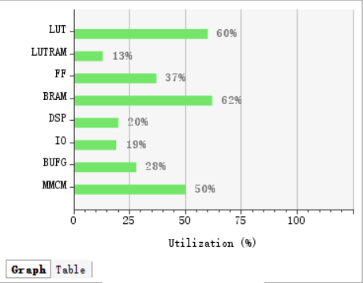
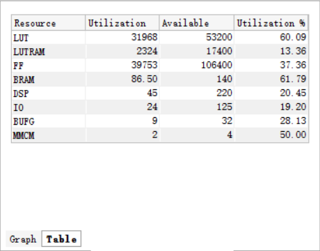
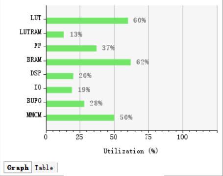
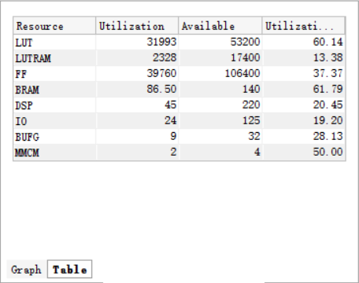
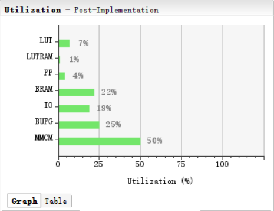

# CNN 优化清单

## 一、人工智能视频教程

* CNN 结构：2层conv网络，1层全连接层，使用ReLU激活函数，没有pool层

    conv1：kernel_size = 5,  feature_in = 32*32,  input channels = 1, output channels = 32

    conv1：kernel_size = 5,  feature_in = 32*32,  input channels = 32, output channels = 32

    ip1: feature_in = 24\*24,  input channels = 32, output channels = 10 (32\*32\*24 --> 10)

    

* 使用平台：EagleGo
* 软件测试的准确率：72.5% （比较低）

###  1.未进行优化

###  2. 优化mmult和copy_buffer

## 二、人工智能视频工程复现

* CNN结构：与上面一致
* 使用平台：EagleGo

### 1.未进行任何优化

### 2.优化mmult和copy_buffer

## 三、CNN优化

