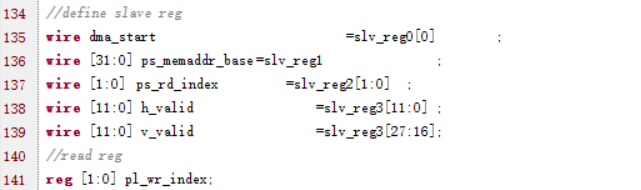
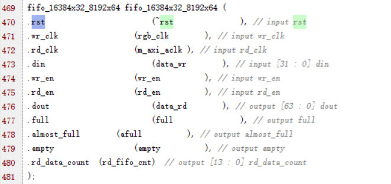
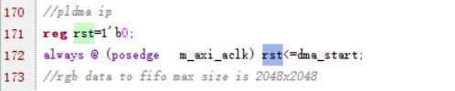
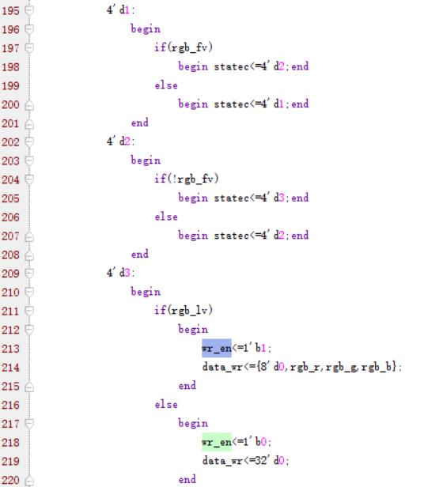
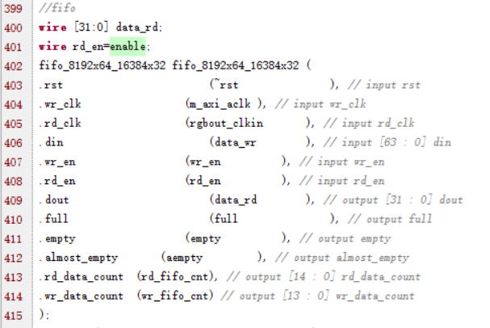

##  sdsoc优化方向

- 浮点数定点化（OK）

- 使用两个mmult优化（OK）

- 优化全连接层

    

## platform说明

GP口：配置分辨率、位宽等

HP口：高速的数据传输

pldma_rgbout：内存中取出数据，显示在hdmi接口上

pldma_rgbin：往内存中写入数据

bayer2rgb：将bayer格式的图像数据转化为rgb格式的图像数据

注意：

- pldma_rgbin和pldma_rgbout间需要进行多帧缓存的控制

- clk_wiz：给axi_dma、bayer2rgb、hdmi等模块提供时钟
- rgbin_clk：来自cmos的图像，经过45度移相达到更稳定的数据

## platform的生成

platform name：==与vivado project的项目名一致==

output directory： director自定义

vivado project：选择.xpr文件

platform tcl：文件很重要，表示了整个platform生成的配置

* pfm_clk 表示可供使用的时钟，要求必须与工程的模块名字一致
* GP口 用于慢速数据的处理，一般是一些关键参数的配置
* ACP口 可以直接访问cache，直接从cache中访问数据
* ==HP口== 用得最多，高速数据处理
* pfm_irq 中断引出，便于控制

bif file：定义生成sd卡bin的文件结构，包含==fsbl.elf、bitstream、elf==三部分

readme：文件的简单说明，没有具体要求

linker sript：链接脚本，这里将栈和堆的大小分别扩充为256KB，128MB，相应程序的映射为DDR

boot directory：boot的目录设置


## vivado功能各模块的详细分析

整个vivado工程中，自己实现的module主要有bayer2rgb，pldma_rgbin、pldma_rgbout、hdmi_tx四个模块组成，下面分别对这些模块进行分析与介绍。

### 1. bayer2rgb模块

对于这个模块的各端口的详细说明如下。

| 接口名称    | 接口类型    | 接口功能                                                     |
| ----------- | ----------- | ------------------------------------------------------------ |
| pix_clk     | input       | 来自cmos自带的rgbin_clk移相45度后的始终，方便获得更加稳定的数据信号，避免出现数据丢失的情形 |
| config_done | input       | cmos配置完成后，开始往外传输检测到的图像数据。config_done是在cmos配置完成后，立即触发的，然后bayer2rgb模块开始解析数据。 |
| bayer_data  | input[7:0]  | 来自cmos配置完成后，发送的bayer格式的图像数据                |
| data_r      | output[7:0] | bayer格式转化为rgb格式的图像数据中的R                        |
| data_g      | output[7:0] | bayer格式转化为rgb格式的图像数据中的G                        |
| data_b      | output[7:0] | bayer格式转化为rgb格式的图像数据中的B                        |
| rgb_fv      | output      | 控制信号，表示一帧图像的开始                                 |
| rgb_lv      | output      | 控制信号，表示每一行有效的数据                               |

还有一点需要说明，总共有4个gpio的控制信号，一个控制bayer2rgb模块的开始运转，hdmi_out_en控制hdmi显示使能，led控制led灯亮，表示程序正常运转，cmos_rst则是cmo必须先进行rst，然后才能配置参数。

上面的4个gpio端口，都是通过emio的方式进行配置的

### 2.FCLK_CLK

关于ps端时钟，做一下的说明，也是通过表格的形式来表示。

| 时钟名称  | 时钟频率 | 时钟功能                                                     |
| --------- | -------- | ------------------------------------------------------------ |
| FCLK_CLK0 | 100MHz   | 用作M_AXI_GP0_ACLK                                           |
| FCLK_CLK1 | 100MHz   | 用作HDMI显示，主要有两部分的时钟，包括148.5MHZ的VGA时钟，HDMI显示还要用到742.5MHz的时钟 |
| FCLK_CLK2 | 200MHz   | 用作S_AXI_HP0_ACLK                                           |
| FCLK_CLK3 | 200MHz   | 没用                                                         |

### 3.pldma_rgbin和pldma_rgbout模块

GP0主要是对pldma_rgbin和pldma_rgbout两个模块进行参数配置，HP0是实现pldma_rgbin和pldma_rgbout与DDR间的数据传输。这两个模块都有两个时钟，分别来自GP0和HP0。下面就分析下不是来自GP0和HP0的一些端口。

#### （1）pldma_rgbin模块

先从pldma_rgbin模块开始，主要是将rgb格式的图像数据写入DDR中，基地址是

关于相应的配置寄存器如下，主要是dma开始控制信号dma_start、ps端DDR基地址ps_memaddr_base、ps读标号设置ps_rd_index、h_valid信号和v_valid信号，以及pl_wr_index信号 



大部分的程序已经写好，这里只需要实现很少部分的控制代码即可。

主要写入相应的控制信号一帧数据framebuffer=2048x2048x4byte，略大于一帧数据。

这部分的实现比课上的代码复杂些，这里涉及到了HP0和GP0两部分的程序。


对于参数的部分，我们暂时不去考虑，主要考虑的是fifo的控制信号。

对于数据写入DDR来说，正常的处理步骤应该是判定数据来了之后，先将数据写入fifo中，待fifo中的数据满足一个突发长度时，将数据从fifo中读取出来，写入DDR中。

写入fifo的时钟频率是pixel_clk，即74.25MHz，比较慢，而DDR从fifo中读取数据和将fifo中读取的数据写入DDR的时钟速率是200MHz，明显快多了，这样就不会出现数据缺失的情形。

还有就是，读写DDR虽然是同步进行的，刚好错开了一帧，不会出现数据出错的情形。



fifo的配置如上图所示，这里主要做一下分析。

* rst信号，在dma_start被拉高之前，整个模块一直处于复位状态



* wr_en信号，一帧信号的开始fv拉高后，lv被拉高，开始往fifo中写入数据。

    lv被拉低后，wr_en立马被拉低，后面就是根据lv的高电平将数据写入fifo中，一直保持不变。

    

* rd_en信号，就是满足一个突发长度，就可以写入fifo中了。

#### （2）pldma_rgbout模块

下面看看另一个模块pldma_rgbout，主要是将DDR中的数据读出，到HDMI显示。

这里的配置参数加上了vga显示的一些参数，都是通过GP0进行配置的，有些参数是两个模块共同有效的。


对于从DDR内存中读取数据，正常处理流程则是，先将数据写入fifo中，当fifo中的数据满足一行时，可以将数据读取出来，用于HDMI显示。

这里也从fifo这块进行简要分析。



* wr_en信号，fifo中不忙时，且保证fifo中随时有一行的数据，fifo中不满一行时，立即往fifo中填充数据
* rd_en信号，来自于vga显示部分，显示完一行后，每次需要重新使能rd_en
* rd_fifo_cnt信号，给了vga模块，判定一开始的显示信号，只需要执行一次，后面能够保证数据的充足，因为HP0读取数据的速度明显高于vga显示的速度

对于hdmi_tx模块，没什么说的，就是普通的显示模块而已。简单的东西，这里不再多说。

------

下面是相关的文件和状态转移图说明

由三部分组成，自己实现的代码主要有user_logic.v和vga720p.v两部分组成。

下面分析user_logic.v代码实现

首先是端口定义，略过。

这里有一些常量，还是要做一些必要的说明。

```verilog
parameter C_MST_NATIVE_DATA_WIDTH        = 64;
parameter C_LENGTH_WIDTH                 = 12;
parameter C_MST_AWIDTH                   = 32;
parameter C_NUM_REG                      = 8;
parameter C_SLV_DWIDTH                   = 32;
```

C_MST_NATIVE_DATA_WIDTH 表示写时的数据宽度是64bit，而读取时的数据宽度为32bit，由C_SLV_DWIDTH作为说明；C_NUM_REG表示总共有8个寄存器，其余部分是什么意思，不是很清楚。（或许有部分说错了）

接着开始寄存器数据的读取，根据地址读取8个寄存器的数值，分别用8个变量存储。主要关注的寄存器变量有dma_start，ps_memaddr_base，  ps_wr_index三个，其余部分是对vga显示的详细配置。pl_rd_index一直保持不变，并没有什么软用，只用了一帧地址，并没有存在数据的切换。

dma_start控制整个DMA开始工作，当没有收到dma_start信号时，DMA一直处于复位状态。启动后开始执行整个程序。

下面是整个程序框架的核心部分，做简要说明。

有两个部分组成，

##### 准备读取数据。

state0：读取DMA_BASE_ADDR

state1：读取fifo剩余容量，fifo中剩余容量较大时，进入state2

	否则不再进行后续步骤，等待fifo为空

state2：开始准备读取数据，read_data_start为1，然后ip2bus_mstrd_dst_rdy_n为0，同时==发送读取数据指令和相应的数据长度==，进入state3

state3：==接收到cmd_ack回复==后，ip2bus_mstrd_dst_rdy_n拉低保持，准备好读取DDR中的数据了。

state4：读取数据完成标志read_data_end拉高，ip2bus_mstrd_dst_rdy_n拉高，read_data_start拉低，读取完毕，进入state5

state5：==接收到cmd complete命令==后，真完成了，进入state6

state6：相应的计算变量dma_cyc_cnt，地址变量app_rd_addr加上相应的数值，为下个周期读数做准备（==地址并没有清零，一帧数据读取完成后，每次需要重新读取地址==）

state7：准备完成，进入下次读取数据

##### 从开始读取数据，到读取数据完毕的状态机

state0：读取相应的数据长度，状态切换至state1

state1：==bus2ip_mstrd_src_rdy_n拉低，即master端准备好读取数据==，开始读取数据，直到读取到最后一个数据，计数read_cnt清零，读取结束标志read_data_end拉高，状态切换至state2

state2：等待read_start_start拉低，一个读取过程结束。

读取过程中，很重要的就是==fifo中数据量的变化，若数据量不变，是没有后续操作的==。

### 4. vga720p

fifo_cnt 与 vga显示也有些关系，这里一并进行介绍。

```verilog
always @ (posedge clock or negedge resetn)
	if(!resetn)
		begin
			de_vaild<=1'b0;
		end
	else
		begin
			if(vsync)
				begin
					if(rd_fifo_cnt>=14'd4096)
						begin
							de_vaild<=1'b1;
						end
					else
						begin
						end
				end
		end
```

主要部分的代码如上所示，要求==rd_fifo_cnt 达到两行==，才能开始读取数据。当然，这部分只是一开始的要求，后面就好说了，这也是至关重要的一部分。