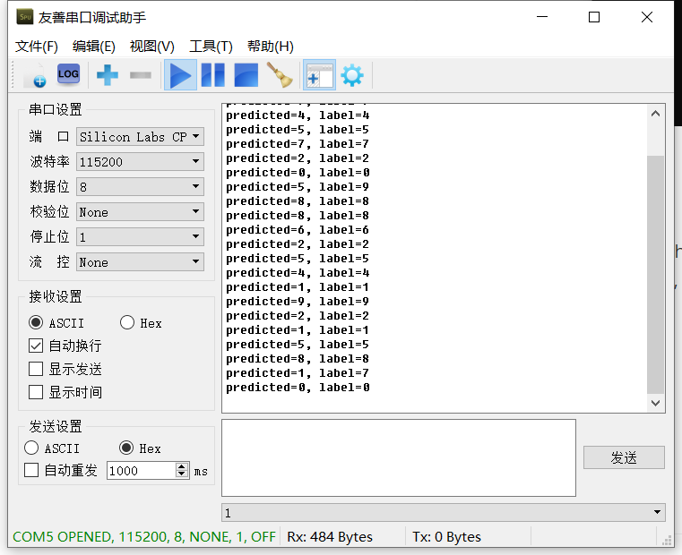

# FPGA_CNN

* use fpga to create cnn， then realize some ai production

* use sdsoc software

## FPGA实现手写数字识别

### 	视频功能重现

1. python直接使用nn实现手写数字识别，可以达到92~93%的准确率

2. python 实现cnn手写数字识别，这里使用了dropout，和lenet5有所区分，具体的网络已经分析出来了

3. conv和pool的hls实现

4. zynq block框架搭建

5. sdk cnn框架搭建，mnist手写数字识别成功

6. cpp上位机端发送图片数据，在zynq端进行识别

    

    由上图可见，实际发送数字与实际结果一致。

###  参数提取

对于这部分，直接采用现有结构即可，关键在于tensorflow和pytorch的参数的定义完全不是一致的，例如tf的数据格式为x、y、z， 到了pytorch这就变成了z、y、z，为了一劳永逸，这里重新设计了conv的结构，变得符合pytorch的格式要求。

### CNN结构改进

改用lenet5实现手写数字识别

可以看到，所有的数字都识别正确，准确率接近100%，这个还是很高的，非常值得提倡。

## FPGA实现cifar10数据集多分类

